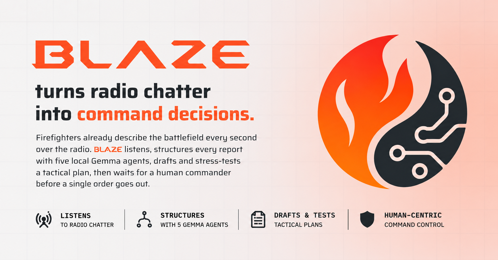
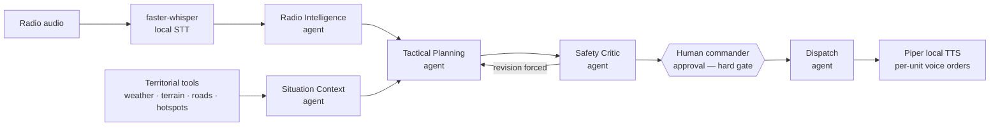

<p align="center">
  
</p>

# BLAZE 🔥

Multi-agent operational intelligence for firefighter radio — **Paris Gemma 4 Hackathon**, Autonomous Agents track + NVIDIA GPU Challenge.

Firefighters already describe the battlefield every second over the radio — then those voices evaporate. BLAZE listens: local speech-to-text turns every radio call into structured operational events, five specialized **Gemma 4 agents** (Radio Intelligence, Situation Context, Tactical Planning, Safety Critic, Dispatch) correlate them with live territorial data into a **versioned tactical plan**, a deterministic orchestrator/state machine routes every step, and a **human incident commander** approves before a single order goes out — as personalized voice instructions per unit, spoken by local TTS. All inference runs **offline on an NVIDIA GPU via vLLM**: zero cloud LLM calls, displayed live in the UI.

## Three hero features

- **An adversarial Safety Critic** — a dedicated agent attacks every plan *before any human sees it*. In the demo it catches a real risk (Alpha 3: 30% water, near-zero visibility) and forces a revision.
- **Approval as a hard gate** — dispatch is impossible in the state machine until the commander clicks Approve. Then, and only then, each unit receives its own French voice instructions, generated by local TTS.
- **A world model that never forgets** — corrections update the plan *without erasing history* (versioned plans, auditable agent trace), and every datum is labeled: live, cached, seeded, human report, or model inference. No hidden cloud, no invented numbers.

## Architecture



Everything the UI shows is the live **SSE event stream**; the Next.js control room is a pure consumer of it, and can run fully standalone against the frozen mock stream (`contracts/mocks/demo_event_stream.jsonl`). State is in-memory and deterministic by design: a reset restores the exact seeded scenario, so demo reruns are reproducible. Schemas in `contracts/` are frozen. Full detail in [docs/ARCHITECTURE.md](docs/ARCHITECTURE.md).

## Quickstart

```bash
git clone https://github.com/aminssutt/Blaze.git
cd Blaze
cp .env.example .env      # fill in what you need (see docs/DATA_SOURCES.md)

# Demo machine (NVIDIA GPU + Docker) — vLLM, backend, frontend, health-gated:
docker compose up -d

# Without a model server (mock/offline mode):
docker compose up -d backend frontend

# macOS / no GPU-in-Docker — same order, same health gates:
./scripts/platform/start_stack.sh          # add SKIP_VLLM=1 for mock mode
```

Then open **http://localhost:3000** for the public landing page, `/workflow` for the live guided intervention, `/expert` for the consultation view, or `/settings` for runtime configuration.

```bash
# Start the incident (also available as a button in the UI):
curl -X POST http://localhost:8080/incident/start

# Reset between runs (deterministic — no restart needed):
curl -X POST http://localhost:8080/incident/reset

# Cut the network live — everything keeps working, the NVIDIA panel proves local inference:
curl -X POST http://localhost:8080/incident/network-mode \
  -H 'Content-Type: application/json' \
  -d '{"network_mode":"offline"}'
```

Five prerecorded radio messages flow through STT, the agents build and stress-test the plan live, the Safety Critic forces a revision, the commander approves, and each unit gets its own voice orders — playable per unit in the UI.

## Documentation

| Doc | Covers |
|---|---|
| [docs/ARCHITECTURE.md](docs/ARCHITECTURE.md) | The whole system: STT → agents → Safety Critic → approval gate → dispatch, the state machine, the SSE bus. |
| [docs/DEMO_SCRIPT.md](docs/DEMO_SCRIPT.md) | The beat-by-beat live demo script (corrections, critic, blackout, approval, voices). |
| [docs/PITCH.md](docs/PITCH.md) | The 3-minute spoken pitch, synchronized with the demo. |
| [docs/JURY_QA.md](docs/JURY_QA.md) | Anticipated jury Q&A (offline vs cloud GPU · what breaks first · why 5 agents). |
| [docs/DATA_SOURCES.md](docs/DATA_SOURCES.md) | Territorial data: Open-Meteo, NASA FIRMS, Cadastre Etalab, OSM — and how each is cached for offline. |
| [docs/SAFETY_AND_LIMITATIONS.md](docs/SAFETY_AND_LIMITATIONS.md) | What BLAZE is and is not; honest limits of the prototype. |
| [docs/KAGGLE_WRITEUP_SUBMISSION.md](docs/KAGGLE_WRITEUP_SUBMISSION.md) | The distilled competition write-up (measured NVIDIA metrics only). |
| [docs/ROADMAP.md](docs/ROADMAP.md) | Roadmap, kanban process, phases. |

## Stack & challenge compliance

**LLM:** Gemma 4, served locally by **vLLM on an NVIDIA GPU** — cloud LLM calls: zero, counted and displayed live in the UI. **Agents:** five specialized Gemma 4 agents with real function calling and per-step auditable traces. **STT:** faster-whisper (French, local). **TTS:** Piper (French voice, local). **Backend:** Python 3.12 · FastAPI · deterministic orchestrator/state machine · SSE. **Frontend:** Next.js · React · TypeScript · Tailwind.

BLAZE is a genuine multi-agent system, not a wrapper: agents select real territorial tools, exchange structured outputs under frozen contracts, and an adversarial critic plus a mandatory human gate sit between reasoning and action. It is a **decision-support and communication system**, not an autonomous emergency commander — see [docs/SAFETY_AND_LIMITATIONS.md](docs/SAFETY_AND_LIMITATIONS.md).

## Repo layout

```text
backend/    FastAPI runtime — orchestrator, state machine, SSE bus, API routers
agents/     the five Gemma 4 agents + shared inference client
inference/  vLLM serving config (NVIDIA GPU)
speech/     faster-whisper STT · Piper TTS
contracts/  frozen schemas, agent interfaces, mock event stream
tools/      territorial tools (weather, terrain, buildings, roads, hotspots)
data/       seed scenario + cached territorial data (full offline demo)
frontend/   Next.js landing page + control room — /workflow, /expert, /settings
demo/       demo assets (prerecorded radio audio)
design/     design tokens
scripts/    ai / platform / product lanes (stack startup, data fetch, E2E)
docs/       project documentation
```

## Requirements

- **Python 3.12+** (backend), **Node 22+** (frontend), Docker for the compose path.
- An **NVIDIA GPU** for local Gemma 4 via vLLM — without one, the mock/offline mode runs the full UI against the frozen event stream.
- Copy `.env.example` to a local `.env` and fill secrets there — **never commit `.env`** (the repo is public).

## Team & ownership

| Who | Workstream | Owns |
|---|---|---|
| [@aminssutt](https://github.com/aminssutt) | AI / Agents | `agents/`, `inference/`, `speech/stt/`, `backend/orchestrator/`, `backend/state/`, `scripts/ai/` |
| [@selyan-mhli](https://github.com/selyan-mhli) | Platform / Backend | `backend/api\|streaming\|loaders/`, `tools/`, `data/`, `speech/tts/`, `scripts/platform/`, `docker-compose.yml`, `.env.example` |
| [@six-16](https://github.com/six-16) | Product / Frontend | `frontend/`, `design/`, `demo/`, `docs/`, `scripts/product/`, `README.md` |

One owner per directory · no direct push to `main` · one branch per issue (`ai/…`, `platform/…`, `product/…`, `integration/…`) · everything merges through PRs · `contracts/` is frozen and any change requires a PR reviewed by all three.
